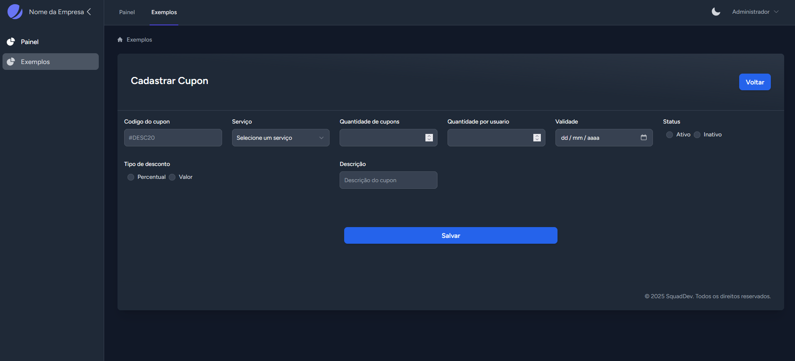

# Laravel Combo Stack


[](https://packagist.org/packages/sh4rck3/laravel_combo_stack)
[](https://packagist.org/packages/sh4rck3/laravel_combo_stack)

Um pacote completo para iniciar projetos Laravel rapidamente, combinando ferramentas essenciais como Jetstream, Inertia.js, Vue 3, e Spatie Permission, além de diversas bibliotecas frontend úteis - tudo pré-configurado e pronto para uso.

## 📋 Recursos

- ✅ **Laravel Jetstream** com Inertia.js & Vue 3
- ✅ **Sistema de autenticação** completo (login, registro, verificação de email, etc)
- ✅ **Spatie Laravel Permission** para gerenciamento de papéis e permissões
- ✅ **Dashboard personalizado** pronto para uso
- ✅ **Estrutura organizada** com separação clara entre controladores web e API
- ✅ **Tema Dark** integrado
- ✅ **10+ bibliotecas frontend** pré-configuradas
- ✅ **Helpers de permissão** para Vue (verificação fácil de papéis/permissões)
- ✅ **Usuários padrão** com papéis pré-configurados

## 🚀 Instalação

```bash
# Instalar via Composer
composer require sh4rck3/laravel_combo_stack

# Executar o comando de instalação
php artisan combo-stack:install
```

O processo de instalação configurará automaticamente:

1. Jetstream com Inertia e Vue 3
2. Sistema de papéis e permissões
3. Middleware e helpers para gerenciamento de permissões
4. Bibliotecas frontend essenciais
5. Usuários demo para cada papel configurado

## ✨ Bibliotecas Frontend Incluídas

| Biblioteca | Descrição | Uso |
|---|---|---|
| **Vue Select** | Componente de dropdown avançado | `<v-select :options="options"></v-select>` |
| **SweetAlert2** | Caixas de diálogo elegantes | `$swal('Hello World!')` |
| **Vue Toast** | Sistema de notificações toast | `$toast.success('Concluído!')` |
| **Laravel Vue Pagination** | Paginação para Laravel | `<Pagination :data="users" />` |
| **Vuex** | Gerenciamento de estado | `this.$store.commit('setUser', user)` |
| **AOS** | Animações on-scroll | `<div data-aos="fade-up">...</div>` |
| **Vue Print** | Impressão de componentes | `v-print="'#printMe'"` |
| **Vue Mask** | Máscaras de input | `v-mask="'##.###-###'"` |
| **FullCalendar** | Calendário interativo completo | `<FullCalendar :options="calendarOptions" />` |
| **ApexCharts** | Gráficos interativos | `<apexchart type="bar" :options="options" :series="series"></apexchart>` |
| **VCalendar** | Seletor de data e calendário | `<v-date-picker v-model="date" />` |

## 🔐 Gerenciamento de Papéis e Permissões

### Papéis Padrão

O sistema vem com os seguintes papéis pré-configurados:

- **Administrador**: Acesso total ao sistema
- **Gerente**: Gerencia conteúdos e acessa relatórios
- **Usuário**: Acesso básico ao conteúdo

### Verificando Papéis e Permissões no Frontend

```vue
<!-- Verificando um papel específico -->
<div v-if="$hasRole('Administrador')" class="p-2 bg-green-100 dark:bg-green-800 rounded text-gray-900 dark:text-gray-100">
              Você tem o papel de Administrador
          </div>

<!-- Verificando uma permissão específica -->
<div v-if="$can('gerenciar-usuarios')" class="p-2 bg-green-100 dark:bg-green-800 rounded text-gray-900 dark:text-gray-100">
              Você pode gerenciar usuários
          </div>

<!-- Verificando vários papéis -->
 <div v-if="$hasAnyRole(['Administrador', 'Gerente'])" class="p-2 bg-green-100 dark:bg-green-800 rounded text-gray-900 dark:text-gray-100">
              Você é um Administrador ou Gerente
          </div>

<!-- Verificando várias permissões -->
<div v-if="$canAny(['gerenciar-usuarios', 'visualizar-usuarios'])" class="p-2 bg-green-100 dark:bg-green-800 rounded text-gray-900 dark:text-gray-100">
              Você pode gerenciar ou visualizar usuários
          </div>
```

### Verificando no Backend (Controllers)

```php
// Verificando um papel
if ($user->hasRole('Administrador')) {
    // Lógica para administradores
}

// Verificando uma permissão
if ($user->can('gerenciar-usuarios')) {
    // Lógica para quem pode gerenciar usuários
}

// Protegendo rotas com middleware
Route::middleware(['role:Administrador'])->group(function () {
    // Rotas acessíveis apenas para administradores
});

Route::middleware(['permission:gerenciar-conteudo'])->group(function () {
    // Rotas acessíveis apenas para quem tem permissão
});
```

## 📁 Estrutura Organizada

O pacote configura uma estrutura de diretórios organizada:

```
app/
├── Http/
│   ├── Controllers/
│   │   ├── Web/
│   │   │   └── PageController.php  // Controladores para páginas web
│   │   └── Api/                    // Controladores para API
│   └── Middleware/
│       └── HandleInertiaRequests.php  // Configurado para compartilhar papéis
resources/
└── js/
    ├── Components/
    │   └── PermissionExample.vue   // Componente demo de permissões
    ├── Pages/
    │   └── Dashboard.vue           // Dashboard personalizado
    ├── Plugins/
    │   └── Permissions.js          // Helper de permissões
    └── Store/
        └── MyStore.js              // Store Vuex pré-configurada
```

## ⚙️ Configuração

Publique o arquivo de configuração para personalizar o comportamento do pacote:

```bash
php artisan vendor:publish --tag=combo-stack-config
```

### Opções de Configuração

```php
// config/combo-stack.php
return [
    // Configurações gerais
    'company_name' => env('APP_NAME', 'Laravel'),
    
    // Jetstream
    'jetstream' => [
        'teams' => true,
        'api' => true,
        'dark_mode' => true,
    ],
    
    // Papéis e permissões iniciais
    'roles' => [
        'admin' => [
            'name' => 'Administrador',
            'permissions' => ['gerenciar-usuarios', 'gerenciar-conteudo', 'acessar-relatorios'],
        ],
        'manager' => [
            'name' => 'Gerente',
            'permissions' => ['gerenciar-conteudo', 'acessar-relatorios'],
        ],
        'user' => [
            'name' => 'Usuário',
            'permissions' => ['acessar-conteudo'],
        ],
    ],
    
    // Usuários padrão
    'create_default_users' => true,
    'default_users' => [
        'admin' => [
            'name' => 'Administrador',
            'email' => 'admin@example.com',
            'password' => 'admin123',
        ],
        // Outros usuários...
    ],
];
```

## 📊 Componentes e Exemplos

### Gráficos com ApexCharts

```vue
<template>
  <div class="card">
    <apexchart 
      type="bar" 
      height="350" 
      :options="chartOptions" 
      :series="series">
    </apexchart>
  </div>
</template>

<script setup>
import { ref } from 'vue';

const chartOptions = ref({
  chart: {
    id: 'vuechart-example'
  },
  xaxis: {
    categories: ['Jan', 'Fev', 'Mar', 'Abr', 'Mai', 'Jun']
  }
});

const series = ref([{
  name: 'Vendas',
  data: [30, 40, 35, 50, 49, 60]
}]);
</script>
```

### Calendário Interativo

```vue
<template>
  <FullCalendar 
    :options="calendarOptions" 
    class="my-4" 
  />
</template>

<script setup>
import { ref } from 'vue';
import dayGridPlugin from '@fullcalendar/daygrid';

const calendarOptions = ref({
  plugins: [dayGridPlugin],
  initialView: 'dayGridMonth',
  events: [
    { title: 'Reunião', date: '2023-03-12' },
    { title: 'Apresentação', date: '2023-03-15' }
  ],
  headerToolbar: {
    left: 'prev,next today',
    center: 'title',
    right: 'dayGridMonth,dayGridWeek,dayGridDay'
  }
});
</script>
```

### Gerenciamento de Estado com Vuex

```vue
<template>
  <div>
    <p>Contador: {{ count }}</p>
    <button @click="increment">Incrementar</button>
    
    <div v-if="notifications.length > 0">
      <div v-for="(notification, index) in notifications" 
           :key="index" 
           class="notification">
        {{ notification.message }}
      </div>
    </div>
  </div>
</template>

<script setup>
import { computed } from 'vue';
import { useStore } from 'vuex';

const store = useStore();

const count = computed(() => store.state.count);
const notifications = computed(() => store.state.notifications);

const increment = () => {
  store.commit('increment');
  store.commit('addNotification', { 
    message: 'Contador incrementado!', 
    type: 'success' 
  });
};
</script>
```

## 📱 Responsividade

Todos os componentes são totalmente responsivos e funcionam em dispositivos móveis, tablets e desktops, aproveitando o Tailwind CSS fornecido pelo Jetstream.

## 🛠️ Requerimentos

- PHP 8.1 ou superior
- Laravel 10.x ou superior
- Node.js e NPM

## 🔄 Atualização

Para atualizar para a versão mais recente:

```bash
composer update sh4rck3/laravel_combo_stack
php artisan combo-stack:install
```

## 📝 Licença

O Laravel Combo Stack é um software de código aberto licenciado sob a licença MIT.

## 🙏 Agradecimentos

- [Laravel](https://laravel.com)
- [Jetstream](https://jetstream.laravel.com)
- [Inertia.js](https://inertiajs.com)
- [Vue.js](https://vuejs.org)
- [Spatie](https://spatie.be)
- Todos os desenvolvedores das bibliotecas frontend incluídas neste pacote.

---

Desenvolvido por [Luccas Woiciechoski](https://github.com/sh4rck3) | [sh4rck3@gmail.com](mailto:sh4rck3@gmail.com)

Código semelhante encontrado com 1 tipo de licença